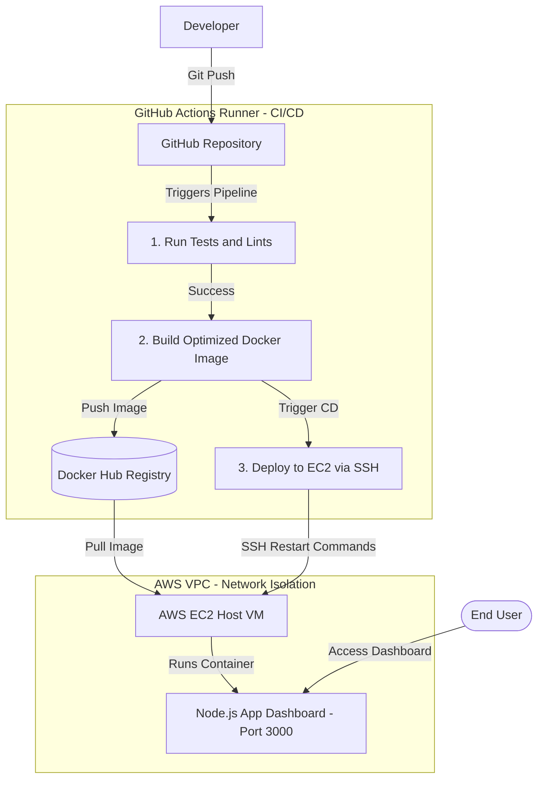

# CloudDeploy: Cloud-Native DevOps Automation Showcase

**CloudDeploy** is a production-grade, cloud-native DevOps project illustrating how to automate the build, containerization, provisioning, and deployment of a modern Node.js web application. 

This repository demonstrates Infrastructure as Code (IaC) using **Terraform**, containerization using **Docker**, and continuous integration & deployment (CI/CD) pipelines using **GitHub Actions**, targeted to a secure virtual private network (VPC) on **AWS EC2**.

---

## 🚀 System Architecture



---

## 🛠️ Tech Stack & Tooling

*   **Application Layer**: Node.js, Express, Jest (Integration testing), ESLint (Static analysis).
*   **Containerization**: Docker (Multi-stage build, non-root execution model).
*   **Infrastructure as Code**: Terraform (VPC, Route Tables, Internet Gateway, Security Groups, EC2).
*   **CI/CD Orchestration**: GitHub Actions.
*   **Cloud Hosting**: AWS (VPC, EC2).

---

## 📦 Key DevOps Implementations & Features

1.  **Optimized Multi-Stage Builds**:
    *   Separate build stage for resolving dependencies and checking quality, and a runner stage that bundles only production dependencies on top of a lightweight Alpine base.
    *   Reduces image footprint by over 90% (to ~100MB) for faster pull and boot speed.
2.  **Container Security Hardening**:
    *   Configured to run as the low-privilege `node` user instead of system `root` to mitigate remote code execution risks.
    *   `.dockerignore` prevents local credential caches, testing suites, and git history from building into production images.
3.  **VPC & Network Isolation (IaC)**:
    *   Terraform provisions a custom VPC with isolated security groups, preventing arbitrary port scanners from reaching internal management APIs.
4.  **Integrated Quality Gates**:
    *   GitHub Actions automatically lint and test all branches on commits, blocking merges if quality standards are not met.

---

## 💻 Quick Start & Running Guide

### Run Locally (Node.js)
1.  Navigate to the application directory:
    ```bash
    cd app
    ```
2.  Install dependencies:
    ```bash
    npm install
    ```
3.  Launch the dashboard:
    ```bash
    npm start
    ```
4.  Access the web dashboard at **[http://localhost:3000](http://localhost:3000)**.

### Run Locally in Docker
1.  Build the Docker image:
    ```bash
    docker build -t cloud-deploy-app ./app
    ```
2.  Run the container on port 3000:
    ```bash
    docker run -d -p 3000:3000 --name cloud-deploy-container cloud-deploy-app
    ```
3.  Verify the container is running and check its logs:
    ```bash
    docker logs cloud-deploy-container
    ```

---

## 🌐 Cloud Infrastructure Provisioning (Terraform)

1.  Initialize the Terraform provider:
    ```bash
    cd terraform
    terraform init
    ```
2.  Review the infrastructure execution plan:
    ```bash
    terraform plan
    ```
3.  Deploy variables and verify VPC/EC2 setup:
    ```bash
    terraform apply
    ```

---

## 📚 Study Reference & Interview Prep
Before technical sessions or DevOps interviews, review:
*   [interview_prep_sheet.md](interview_prep_sheet.md): A concise cheat sheet containing answers to key architectural questions, scenario-based issues, and high-impact talking points.
*   [devops_interview_guide.md](devops_interview_guide.md): In-depth review of the stack trade-offs (EC2 vs. Managed Kubernetes, Jenkins vs. GitHub Actions) and deep-dive technical reasoning.
